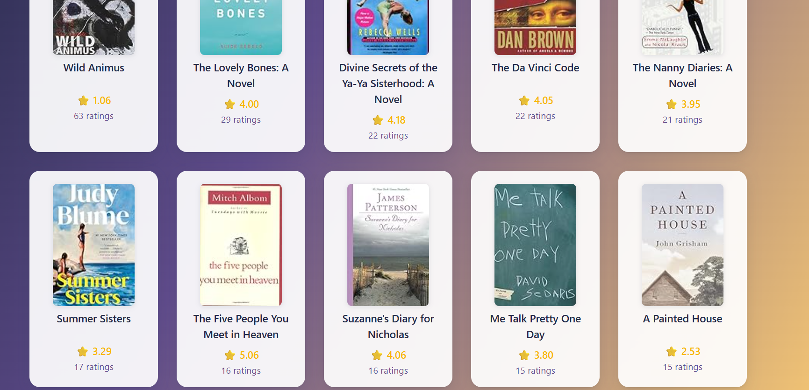

# Popularity Based Book Recommendation

A simple Flask web app that displays the top 10 most popular books with their cover images, average ratings, and number of ratings. The app uses a CSV file as its data source and features a visually appealing "evening nostalgia" theme.

---

## Demo




---

## Features

- Shows top 10 popular books from your dataset
- Displays book cover, title, average rating, and number of ratings
- Responsive, modern UI with Bootstrap and custom CSS
- Easy to customize for your own dataset

---

## Folder Structure

```
Popularity_based_recommendation/
│
├── app.py
├── books datasets/
│   └── top_books_final.csv
├── templates/
│   └── index.html
├── images/
│   ├── screenshot1.png
│   └── screenshot2.png
└── README.md
```

---

## Getting Started

### 1. Clone the repository

```sh
git clone https://github.com/yourusername/popularity_app.git
cd popularity_app
```

### 2. Install dependencies

It is recommended to use a virtual environment:

```sh
python -m venv .venv
.venv\Scripts\activate  # On Windows
# Or
source .venv/bin/activate  # On Mac/Linux

pip install flask pandas
```

### 3. Add your dataset

Place your `top_books_final.csv` file inside the `books datasets` folder.  
The CSV should have these columns:  
`Book-Title, Avg-Rating, Num-Ratings, Image-URL-M`

### 4. Run the app

```sh
python app.py
```

Visit [http://localhost:5000](http://localhost:5000) in your browser.

---

## Example

Here’s how the app looks:


---

## Customization

- **Change the number of books:**  
  Edit `.head(10)` in `app.py` to show more or fewer books.
- **Change the theme:**  
  Edit the CSS in `templates/index.html` for your own color scheme.

---

## License

This project is open source and available under the [MIT License](LICENSE).

---

## Credits

- [Flask](https://flask.palletsprojects.com/)
- [Bootstrap](https://getbootstrap.com/)
- Book cover images from your dataset

---

## Screenshots

Add your screenshots in the `images/` folder and update the links above.
